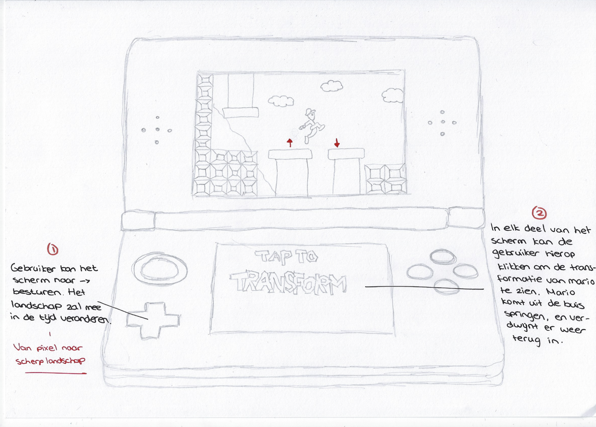
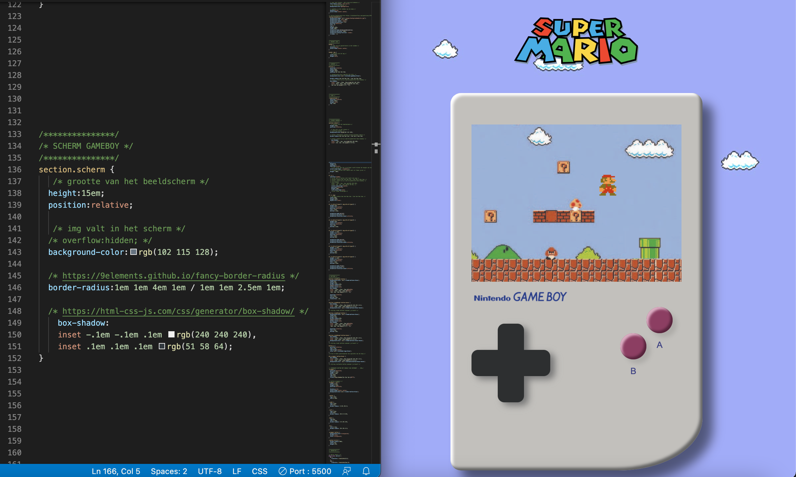

# Procesverslag
Markdown is een simpele manier om HTML te schrijven.  
Markdown cheat cheet: [Hulp bij het schrijven van Markdown](https://github.com/adam-p/markdown-here/wiki/Markdown-Cheatsheet).

Nb. De standaardstructuur en de spartaanse opmaak van de README.md zijn helemaal prima. Het gaat om de inhoud van je procesverslag. Besteedt de tijd voor pracht en praal aan je website.

Nb. Door *open* toe te voegen aan een *details* element kun je deze standaard open zetten. Fijn om dat steeds voor de relevante stuk(ken) te doen.

## Isabelle Duivenvoorden

### Ontwerper:
Isabelle Duivenvoorden

#### Je startniveau:
Mijn startniveau is: blauw

# Je plan

  
De eerste versie/schets van je ontwerp & je persoonlijke uitdaging

  ### De eerste versie/schets:
  

  ### Je ambitie: 
  Aan deze technieken/punten wil ik werken:
  - leren animeren in CSS
  - leren meer diepte te creëren in mijn designs met shadows, om het zo realistisch mogelijk te laten lijken
  - overzichtelijke en duidelijke structuur leren aanbrengen in mijn code
  - 
 

## Voortgang/Feedback 1

  
Tijdens de eerste feedback sessie heb ik voornamelijk mijn concept aangescherpt. Het concept is goed genoeg om mee verder te gaan. Samen met Timo heb ik nagedacht over de transities tussen de verschillende games/schermen. Ik twijfelde tussen transitie van links naar rechts, of van boven naar beneden. Aangezien ik Mario door verschillende buizen wil laten  verplaatsen, is het het meest logisch om het scherm verticaal (boven > beneden) te laten bewegen. 
    
Feedback Timo: Hou het realistisch, je hebt weinig tijd. Leuk idee om allemaal versies van Mario en Mario spellen te laten zien. Je kan Z-index gebruiken in de css voor diepte. Voor detail zou ik de andere beestjes in het spel ook laten bewegen. Je kan per spel ook kijken of het console veranderd. Denk goed na over welke animatie je gaat toepassen per knop. Zorg dat er een duidelijke volgende stap is.
    

  ### Bevinding 1:
  Interactie van mijn prototype door middel van scrollen. Dit wellicht later aanpassen naar klikken door buttons.

  ### Bevinding 2:
  Transitie van het scherm wordt van boven naar beneden (verschillende spellen uit steeds een moderner tijdperk)

  ### Bevinding 3:
  Niet alleen Mario, maar ook kleine details in de spellen animeren voor extra interactie.
    
  ### Bevinding 4:
  ...

  ### Bevinding 5:
  ...
    

## Voortgang/Feedback 2

  
Na afgelopen keer heb ik het een en ander gewijzigd aan mijn concept. In plaats van Mario door de buizen laten verplaatsen en vervolgens automatisch doorschuiven naar het volgende beeld, ga ik de gebruiker laten scrollen door de verschillende schermpjes. Dit was wat betreft code beter haalbaar voor mij. Ik maak drie verschillende schermen waarin drie verschillende games in te zien zijn, allemaal uit een ander jaartal (1985 - 1991 - 2009). Na 2009 zijn er geen hele grote wijzigingen meer doorgevoerd in het karakter van Mario. Verder heb ik een bijpassende achtergrond toegebvoegd die ik wil laten bewegen. Ik ga kijken hoe ik de wolkjes langzaam kan laten bewegen, zodat er iets meer interactie is. Hieronder staan nog een aantal belangrijke punten beschreven die niet in orde. Deze punten heb ik uiteindelijk kunnen oplossen door de juiste code te gebruiken.(minimaal 5)

  
  
  ### Bevinding 2:
  De img valt niet netjes in de vorm van het schermpje.
  
  #### oplossing:
  Dit heb ik kunnen oplossen door overflow:hidden; te gebruiken. 
  
  
  
  
  ### Bevinding 1:
  Na het plaatsen van een img in het scherm van de gameboy kreeg ik deze niet netjes in het kader geplaatst. Dit heb ik opgelost door overflow:hidden te gebruiken. Zie foto's van before en after.
  
  

  #### oplossing:
  Dit heb ik uiteindelijk kunnen oplossen door overflow:hidden te gebruiken.

  ### Bevinding 2:
  Tijdens het scrollen door de verschillende schermen snapte het scherm niet netjes vast op één punt. 
  
  #### oplossing:
  Door scroll-snap-type: y mandatory; te gebruiken. --> y zodat het beeld vast valt in het frame op de y-as.

  ### Bevinding 3:
  ...

## Voortgang/Feedback 3

  
Mijn bevindingen + wijzigingen (minimaal 5)

  
  ### Bevinding 1:
  Omschrijving van wat er nog niet orde was (tekst en afbeeding(en)).

  #### oplossing:
  Beschrijving hoe je het hebt hebt opgelost of als het niet gelukt is hoe je het zou oplossen (tekst en afbeeding(en)).

  ### Bevinding 2:
  Omschrijving van wat er nog niet orde was (tekst en afbeeding(en)).

  #### oplossing:
  Beschrijving hoe je het hebt hebt opgelost of als het niet gelukt is hoe je het zou oplossen (tekst en afbeeding(en)).

  ### Bevinding 3:
  ...

## Reflectie

  
Mijn eindresultaat & persoonlijke ontwikkeling

  ### Je uitkomst - karakteristiek screenshot(s):
  

  ### Dit ging goed/Heb ik geleerd: 
  Korte omschrijving met plaatje(s)

  

  ### Dit was lastig/Is niet gelukt:
  Korte omschrijving met plaatje(s)

  

## Bronnenlijst

continu bijhouden terwijl je werkt

Nb. Wees specifiek ('css-tricks' als bron is bijv. niet specifiek genoeg).

1. https://www.europosters.nl/posters/super-mario-bros-1-1-v24059
2. https://www.keepitkrute.top/ProductDetail.aspx?iid=475931990&pr=44.88 
3. https://logos-world.net/super-mario-logo/ 
4. https://www.pngplay.com/nl/image/265146
5. https://mario.fandom.com/wiki/Piranha_Plant
6. https://stackoverflow.com/questions/37903824/how-can-i-make-infinite-flowing-background-with-only-css
7. https://www.logolynx.com/topic/nintendo+game+boy
8. https://codepen.io/thefewunshaken/pen/bjYWvB
9. https://www.logolynx.com/topic/nintendo+game+boy
10.https://www.fontspace.com/super-plumber-brothers-font-f9287

