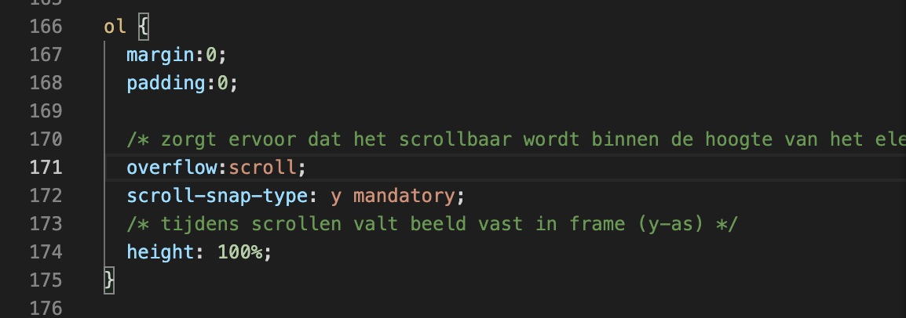
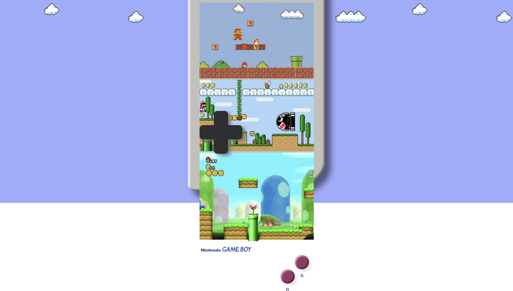
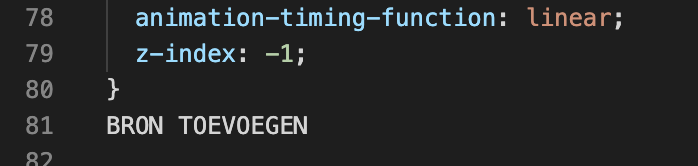
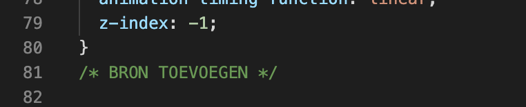
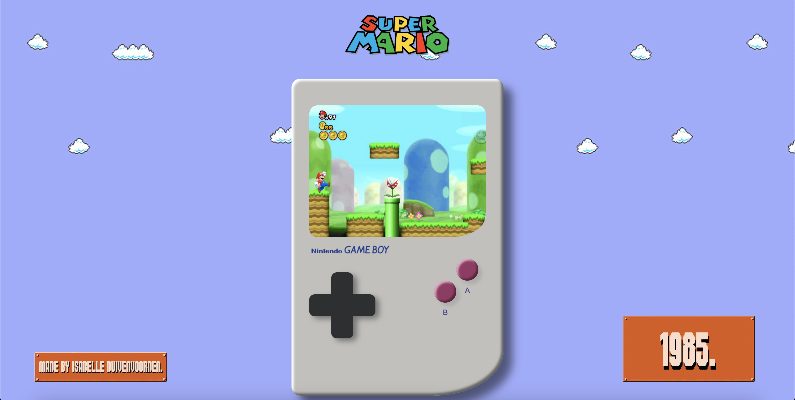
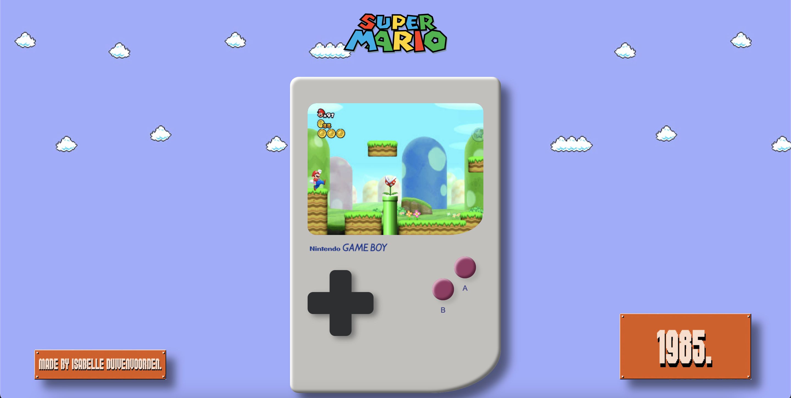
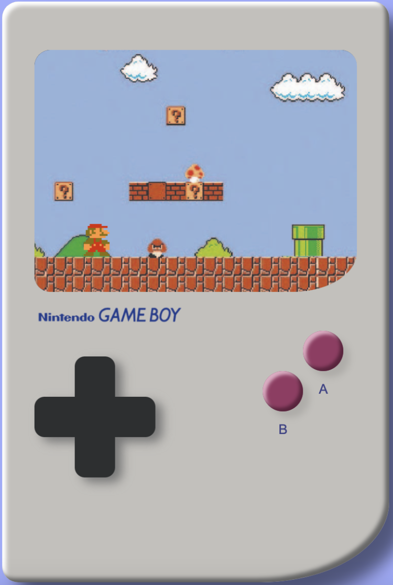
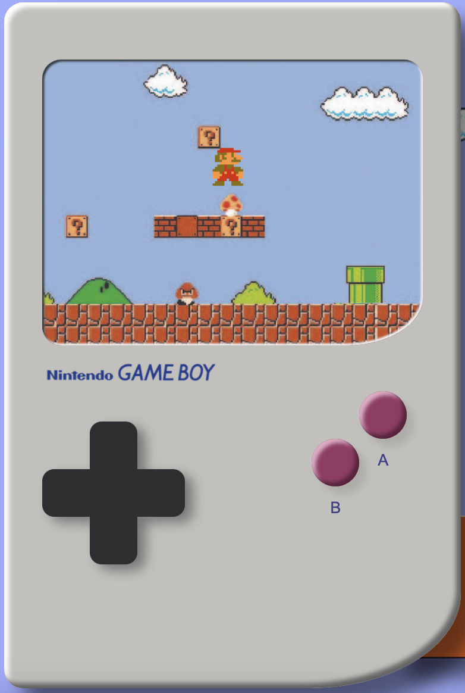
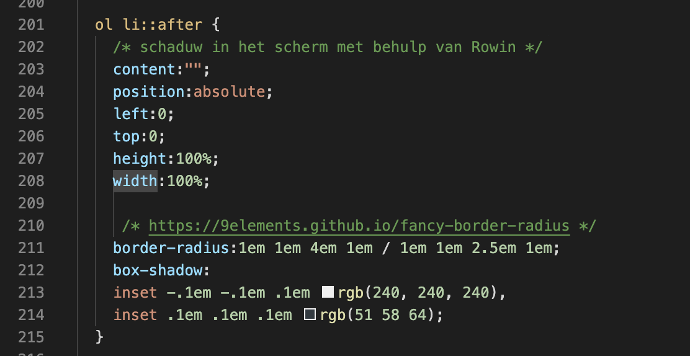
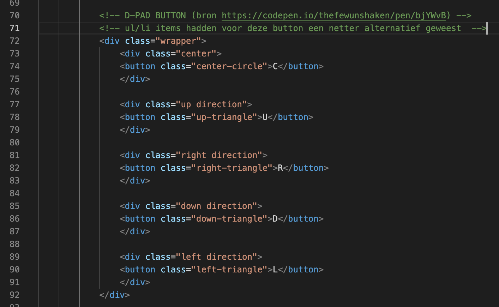

# Procesverslag
Markdown is een simpele manier om HTML te schrijven.  
Markdown cheat cheet: [Hulp bij het schrijven van Markdown](https://github.com/adam-p/markdown-here/wiki/Markdown-Cheatsheet).

Nb. De standaardstructuur en de spartaanse opmaak van de README.md zijn helemaal prima. Het gaat om de inhoud van je procesverslag. Besteedt de tijd voor pracht en praal aan je website.

Nb. Door *open* toe te voegen aan een *details* element kun je deze standaard open zetten. Fijn om dat steeds voor de relevante stuk(ken) te doen.

## Isabelle Duivenvoorden

### Ontwerper:
Isabelle Duivenvoorden

#### Je startniveau:
Mijn startniveau is: blauw

# Je plan

  
De eerste versie/schets van je ontwerp & je persoonlijke uitdaging

  ### De eerste versie/schets:
  

  ### Je ambitie: 
  Aan deze technieken/punten wil ik werken:
  - leren animeren in CSS
  - leren meer diepte te creëren in mijn designs met shadows, om het zo realistisch mogelijk te laten lijken
  - overzichtelijke en duidelijke structuur leren aanbrengen in mijn code
  - algemen kennis van HTML en CSS opfrissen
 

## Voortgang/Feedback 1

  
Tijdens de eerste feedback sessie heb ik voornamelijk mijn concept aangescherpt. Het concept is goed genoeg om mee verder te gaan. Samen met Timo heb ik nagedacht over de transities tussen de verschillende games/schermen. Ik twijfelde tussen transitie van links naar rechts, of van boven naar beneden. Aangezien ik Mario door verschillende buizen wil laten  verplaatsen, is het het meest logisch om het scherm verticaal (boven > beneden) te laten bewegen. 
    
Feedback Timo: Hou het realistisch, je hebt weinig tijd. Leuk idee om allemaal versies van Mario en Mario spellen te laten zien. Je kan Z-index gebruiken in de css voor diepte. Voor detail zou ik de andere beestjes in het spel ook laten bewegen. Je kan per spel ook kijken of het console veranderd. Denk goed na over welke animatie je gaat toepassen per knop. Zorg dat er een duidelijke volgende stap is.
    

  ### Bevinding 1:
  Interactie van mijn prototype door middel van scrollen. Dit wellicht later aanpassen naar klikken door buttons.

  ### Bevinding 2:
  Transitie van het scherm wordt van boven naar beneden (verschillende spellen uit steeds een moderner tijdperk).

  ### Bevinding 3:
  Niet alleen Mario, maar ook kleine details in de spellen animeren voor extra interactie.
    
  ### Bevinding 4:
  Goed idee om later een leuke background image toe te voegen.

  ### Bevinding 5:
  Gebruik maken van Z-index in CSS voor diepte. 
    

## Voortgang/Feedback 2

  
Na feedbackmoment 1 keer heb ik het een en ander gewijzigd aan mijn concept. In plaats van Mario door de buizen te laten verplaatsen en vervolgens automatisch doorschuiven naar het volgende image, ga ik de gebruiker laten scrollen door verschillende images in het scherm. 
    
 Ik maak drie verschillende schermen waarin drie verschillende games te zien zijn, allemaal uit een ander jaartal (1985 - 1991 - 2009). Verder heb ik een background image aan mijn ontwerp toegevoegd om de look & feel passender te maken. Ik heb gekozen voor een rustige achtergrond kleur met subtiele wolkjes. Ik heb erover nagedacht om per image/game de background image mee te laten veranderen, maar uiteindelijk heb ik besloten het toch te laten bij één vaste achtergrond, omdat ik het anders te druk vond worden. Hieronder nog een aantal bevindingen, die ik uiteindelijk heb kunnen oplossen door de juiste code te gebruiken.

  
  
  ### Bevinding 1:
  Na het plaatsen van een img in het scherm van de gameboy kreeg ik deze niet netjes in het kader geplaatst.
  
  #### oplossing:
  Dit heb ik kunnen oplossen door overflow:hidden; te gebruiken. 
  
  
  

  
  ### Bevinding 2:
  Na het plaatsen van de afbeeldingen in mijn HTML ben ik deze in CSS gaan stylen. Waar ik hierbij ook tegenaan liep was dat de afbeeldingen alle drie    onder elkaar vielen (de eerste binnen het scherm van de gameboy en de andere twee buiten het scherm). 
  
  #### oplossing:
  Door de overige twee afbeeldingen die buiten het scherm van de gameboy vielen te verbergen heb ik overflow:hidden; gebruikt. 
  
  
  
 
  
  
  ### Bevinding 3:
  Na het plaatsen van de drie verschillende images wilde ik deze graag scrollbaar maken.
  
  #### oplossing:
  Om door de afbeeldingen te kunnen scrollen heb ik overflow:scroll; gebruikt. Dit zorgt er dus voor dat het scrollbaar wordt binnen de hoogte van het element zelf (de partent (schermpje vd gameboy) waar de img in is geplaatst. 
  
  

  
  
  ### Bevinding 4:
  Tijdens het scrollen door de verschillende schermen snapte het scherm niet netjes vast op één punt.
  
  #### oplossing:
  Dit heb ik opgelost door scroll-snap-type: y mandatory; te gebruiken. --> y zodat het beeld vast valt in het frame op de y-as.
  
  

  ### Bevinding 5:
  Nog een ander belangrijk leermoment voor mij waardoor mijn code crashte; ik had voor mijzelf in mijn code genoteerd dat ik nog een bepaalde bron moest vermelden. Doordat ik deze tekst niet in een comment had geplaatst werkte mijn code niet meer.
  
  #### oplossing:
  Wanneer je eigen geschreven tekst vergeet in een comment te plaatsen, wordt alle code daaronder onleesbaar. Dit deel van mijn website viel daardoor weg.
  
  
  
  

  
## Voortgang/Feedback 3
  

  
De laatste stappen die ik in mijn website heb doorgevoerd zijn in plaats van het scrollen door de schermen, de buttons klikbaar maken. Verder heb ik gekeken naar hoe ik de wolkjes in de background image langzaam kan laten bewegen, zodat er net iets meer interactie is. Om wat extra uitleg te geven aan mijn website heb ik rechtsbovenin een 'info'-button toegevoegd waarop de gebruiker kan klikken. En als laatste onderdeel heb ik per scherm het jaartal van de game toegevoegd, die mee veranderd wanneer je door de schermen klikt. Verder hieronder nog een aantal extra punten waar ik tegenaan liep en hoe ik dit vervolgens heb opgelost.

  
  ### Bevinding 1:
  De jaartallen onderin het scherm passen niet erg mooi in de rest van het design. Na feedback gekregen te hebben van Rowin heb ik besloten om er een box shadow achter te plaatsen.

  #### oplossing:
  Beschrijving hoe je het hebt hebt opgelost of als het niet gelukt is hoe je het zou oplossen (tekst en afbeeding(en)).
  
  
  
  

  ### Bevinding 2:
  De inset box shadow van het schermpje is niet meer zichtbaar. Om toch nog iets meer detail in de gameboy toe te voegen wilde ik dit toch nog graag toevoegen. Helaas is het mijzelf niet gelukt, maar met Rowin zijn hulp wel. 

  #### oplossing:
  Zie code in bijgevoegde afbeelding. 
  
  
  
  

  ### Bevinding 3:
  De vierkante button in mijn gameboy heb ik uiteindelijk met behulp van code van internet kunnen coderen. De onderdelen van deze button zijn allemaal in losse div'jes geplaatst. In plaats van div'jes te gebruiken had deze code ook geschreven kunnen worden door een unordered list (ul) en list items te gebruiken. Uiteindelijk heb ik de code niet hiernaar aangepast, omdat de code in mijn CSS anders niet meer klote. Wel was dit achteraf gezien netter geweest. 
  
  

## Reflectie

  
Mijn eindresultaat & persoonlijke ontwikkeling

  ### Je uitkomst - karakteristiek screenshot(s):
  

  ### Dit ging goed/Heb ik geleerd: 
  Korte omschrijving met plaatje(s)

  

  ### Dit was lastig/Is niet gelukt:
  Korte omschrijving met plaatje(s)

  

## Bronnenlijst

continu bijhouden terwijl je werkt

Nb. Wees specifiek ('css-tricks' als bron is bijv. niet specifiek genoeg).

1. https://www.europosters.nl/posters/super-mario-bros-1-1-v24059
2. https://www.keepitkrute.top/ProductDetail.aspx?iid=475931990&pr=44.88 
3. https://logos-world.net/super-mario-logo/ 
4. https://www.pngplay.com/nl/image/265146
5. https://mario.fandom.com/wiki/Piranha_Plant
6. https://stackoverflow.com/questions/37903824/how-can-i-make-infinite-flowing-background-with-only-css
7. https://www.logolynx.com/topic/nintendo+game+boy
8. https://codepen.io/thefewunshaken/pen/bjYWvB
9. https://www.logolynx.com/topic/nintendo+game+boy
10.https://www.fontspace.com/super-plumber-brothers-font-f9287

